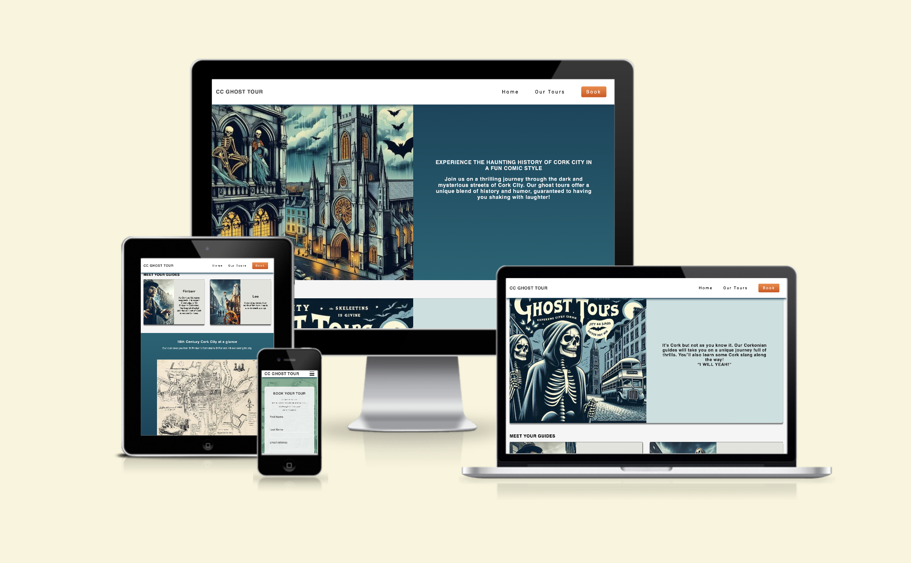
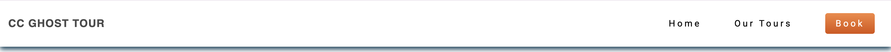
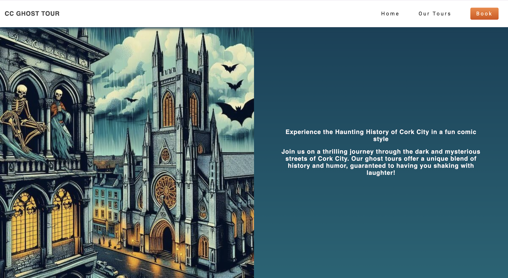
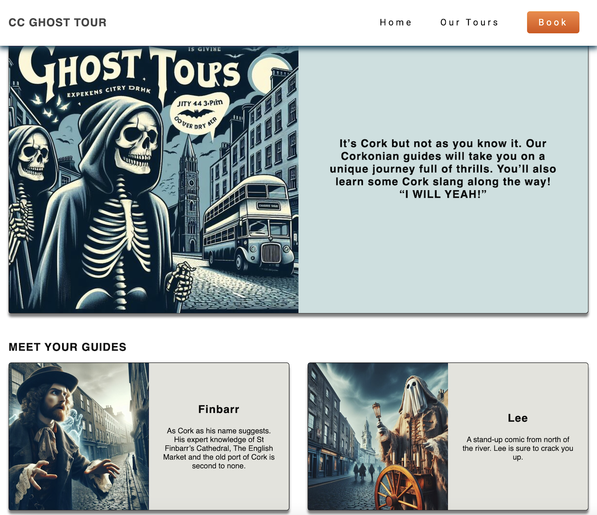
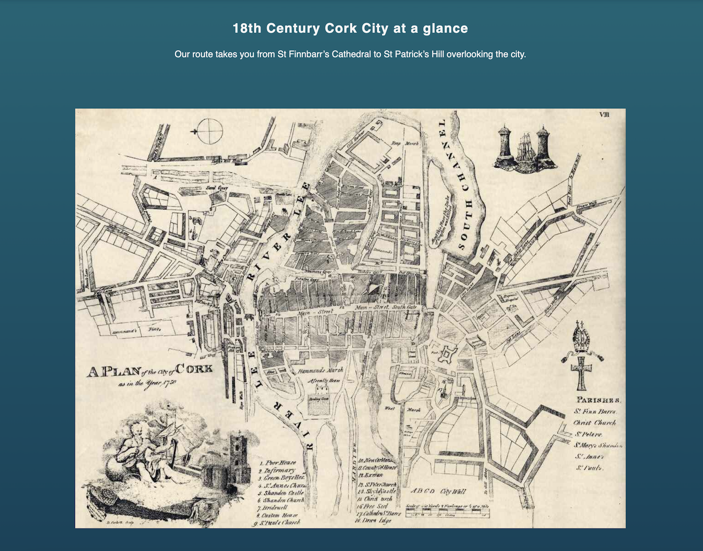
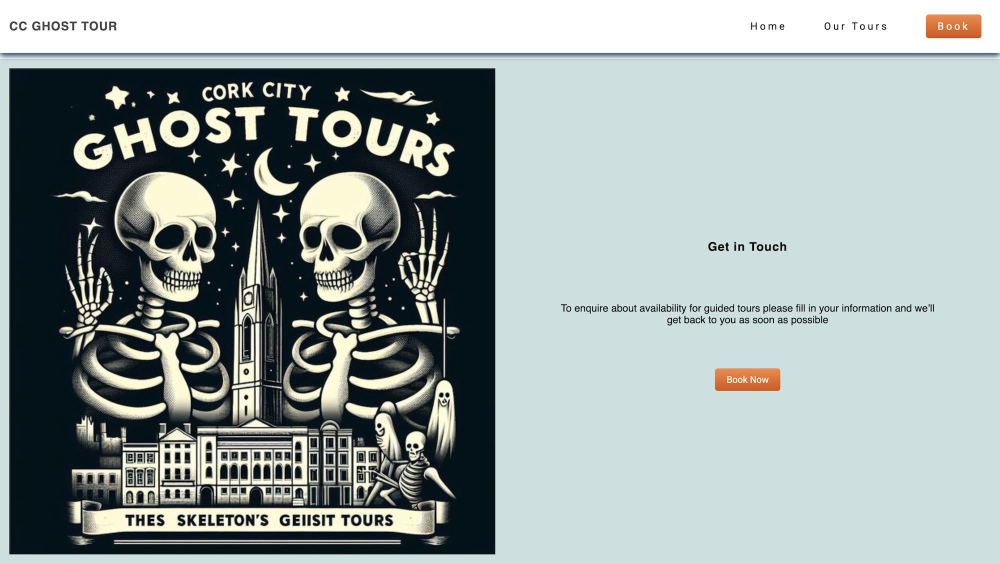
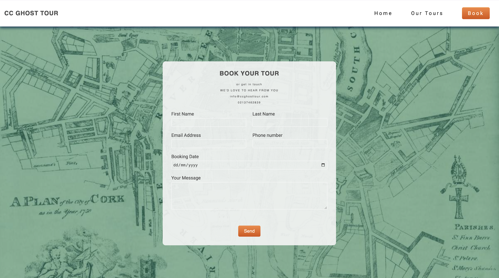
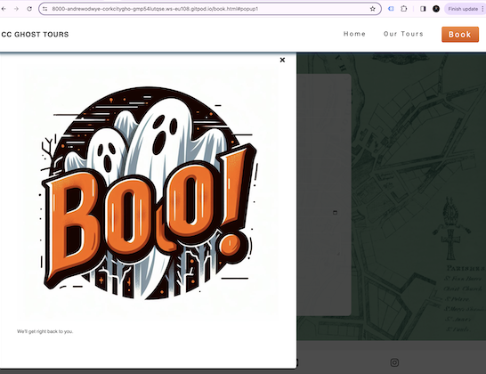

# CC Ghost Tours

This is a visual online presence for Cork City ghost tour. This website will inform the viewer of the 
The target audience would be individual and families interested in a cultural and fun haunted tour of 18th century Cork city. Families from the area and also families visiting Cork as tourists, seeking family-friendly activities that provide cultural and historical insights.
CC Ghost Tour will provide information on the type of ghost tours on offer, who will provide the tours, where it will take place and how to get in contact to book a tour. 

## UX
-__Colour Choice__
  -The colour palette is made up of blues, greens and complemented with orange. A split complementary scheme, in desaturated tones to give a relaxed feeling that is pleasing to the eye.
  -The use of white text on the darker values/tones and dark grey text on lighter values, means the text is easy is read.  

-__Wireframe and Prototype__
  -

## Features 

In this section, you should go over the different parts of your project, and describe each in a sentence or so. You will need to explain what value each of the features provides for the user, focusing on who this website is for, what it is that they want to achieve and how your project is the best way to help them achieve these things.

### Existing Features

- __Navigation Bar__

  - Featured on all three pages, the full responsive navigation bar includes links to the Logo, Home page, Gallery and Sign Up page and is identical in each page to allow for easy navigation.
  - This section will allow the user to easily navigate from page to page across all devices without having to revert back to the previous page via the ‘back’ button. 

-__button__

  - The button was designed to stand out. The image below shows the button without hover on the left and with hover on the right. The gradient changes from light orange down to dark orange down. This subtle change is a visual cue that in keeping with the use of gradients throughout the website.

  [button](documentation/images/btn_and_btn.hover.png)

- __The landing page image__

  - The landing includes a photograph with text overlay to allow the user to see exactly which location this site would be applicable to. 
  - This section introduces the user to Love Running with an eye catching animation to grab their attention

- __Tour Description__

  - The club ethos section will allow the user to see the benefits of joining the Love Running meetups, as well as the benefits of running overall. 
  - This user will see the value of signing up for the Love Running meetups. This should encourage the user to consider running as their form of exercise. 

- __Call to Action__

  - This section will allow the user to see exactly when the meetups will happen, where they will be located and how long the run will be in kilometers. 
  - This section will be updated as these times change to keep the user up to date. 

- __The Footer__ 

  - The footer section includes links to the relevant social media sites for Love Running. The links will open to a new tab to allow easy navigation for the user. 
  - The footer is valuable to the user as it encourages them to keep connected via social media

- __Book Page__

  - This page will allow the user to send contact details in order to make a booking. This form asks for 1. First Name 2. Last name 3. Email Address 4. Phone number 5. Booking Date & 6. Your message. After filling in all the required forms, the user will be prompted to submit the form with the “Send” button.

### Features Left to Implement

- I'd like to introduce a hover page. It will display after clicking the form submit button, to indicate the form was sent successfully.
I thought i could use an anchor element for to the submit button to have a ghost picture pop up. However, I was not able to do this on html and css alone. This is an early idea.

## Testing 

In this section, you need to convince the assessor that you have conducted enough testing to legitimately believe that the site works well. Essentially, in this part you will want to go over all of your project’s features and ensure that they all work as intended, with the project providing an easy and straightforward way for the users to achieve their goals.

In addition, you should mention in this section how your project looks and works on different browsers and screen sizes.

You should also mention in this section any interesting bugs or problems you discovered during your testing, even if you haven't addressed them yet.

If this section grows too long, you may want to split it off into a separate file and link to it from here.

### Testing 

- HTML
  - No errors were returned when passing through the official [W3C Validator] (https://validator.w3.org/nu/?doc=https%3A%2F%2Fandrewodwyer.github.io%2FCork-City-Ghost-Tours%2Findex.html)
- CSS
  - No errors were found when passing through the official [(Jigsaw) Validator] (https://jigsaw.w3.org/css-validator/validator?uri=https%3A%2F%2Fandrewodwyer.github.io%2FCork-City-Ghost-Tours%2Findex.html&profile=css3svg&usermedium=all&warning=1&vextwarning=&lang=en)
- Accessibility
  - The colour and font used make it very easy to read the text while still pleasing to the eye.
  - I used Lighthouse in DevTools to confirm that every page scores well for accessibility.

#### Browser Testing

The site has been tested on the following browsers: Chrome, Safari, firefox & Edge. The layout and functionality was consistent throughout the testing. links, navigation and form submit all work as intended.

#### Manual testing

Actions and results. 
On click, CC Ghost Tour text/logo brings you to the home page.
Navbar buttons: when clicked, they take you to different sections or pages. 
Book/submit button: when clicked, it will show the code institute form submitted
Name, email, phone, date & your message inputs are all required on the form in booking page: If not filled out correctly, it prompt user to do so before allowing them to submit the form. 
Social link icons (X, instagram, facebook, you-tube): when clicked, opens pages for those particular social networks.
All work correctly.

### Unfixed Bugs

There are no unfixed bus.

## Deployment

Log in to GitHub and select CC ghost tour repository.
From this repository, navigate to "Settings" (This is at the top of the page).
when in settings, navigate to pages from the left-hand menu.
In source select “Deploy from a Branch” in the drop down menu.
In branch select “main”. The folder next to it will be “/(root)”
At this point you click “Save”
Your site is now being deployed.
After several minutes the site was deployed.
A link to the deployed site is at the top of this page, click “Visit site”
Alternatively, To get access to the deployed site, click on the “Code” tab of the repository.
On the right-hand side under “environments” click on “GitHub-pages”
In the newly opened pages, click on “view deployment”
[live site](https://andrewodwyer.github.io/Cork-City-Ghost-Tours/)

## Credits 

Code-institute:
The navigation bar and footer originally code was originally sourced from the Love Running Project at Code Institute. The form on the booking Page was also inspired by the Love Running project. However, none of these remain in their original form. Additional code was added to css and html.
W3schools: 
I used w3schools to plan the button and button:hover css layout & colour.
[button css] (https://www.w3schools.com/css/tryit.asp?filename=trycss_buttons_hover)
Semantic elements like section, div etc
[Semantic](https://www.w3schools.com/html/html5_semantic_elements.asp)
HubSpot:
[Tutorial on Git & Github] (https://product.hubspot.com/blog/git-and-github-tutorial-for-beginners)
Stackoverflow:
I got a better understanding of flexbox from stackoverflow.
[setting distance in flex](https://stackoverflow.com/questions/20626685/how-do-i-set-distance-between-flexbox-items)

### Content 

- The text for the Home page was written by the developer, Andrew O'Dwyer.
- The icons in the footer were taken from [Font Awesome](https://fontawesome.com/)
- Favicon: from icons8.com https://icons8.com/icons/set/favicon-ghost I was able to get a stock ghost icon and change the colours to suit my colour palette.

### Media

- The images used on the home page are AI generated in bing, powered by chatgpt Dall-e. https://www.bing.com/images/create/?ref=hn
- The 18th century map used for the booking page was taken from https://www.linkedin.com/pulse/corporation-cork-city-ireland-agreed-make-provision-scheme-holohan
- These images were then resized using https://imageresizer.com/

[def]: assets/images/ghost_tour_cork_skeleton.jpeg
[def2]: assets/images/ghost_tour_cork_skeleton.jpeg